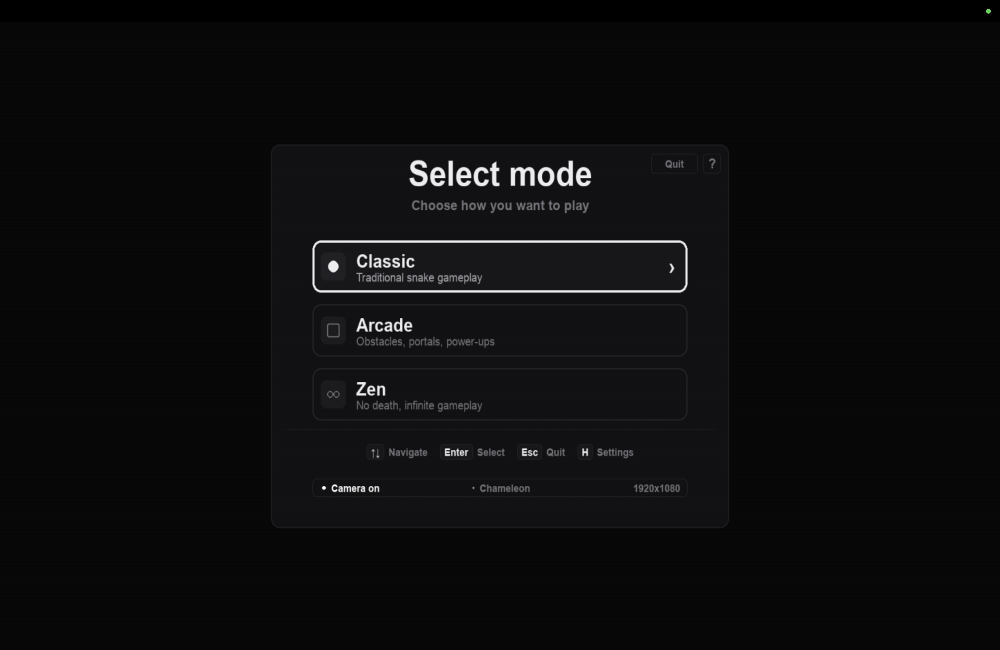
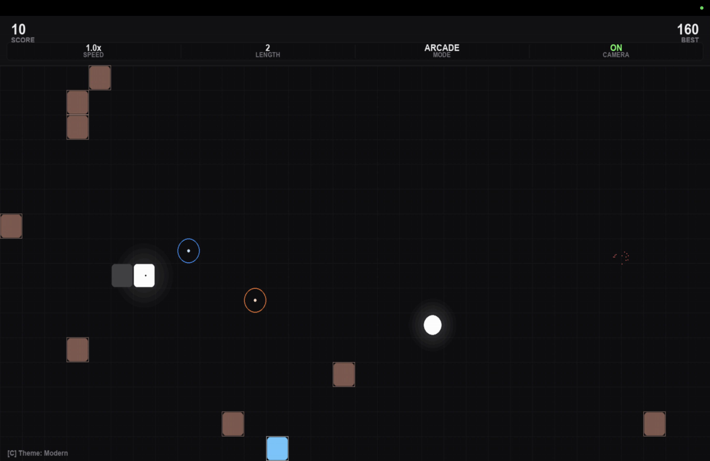
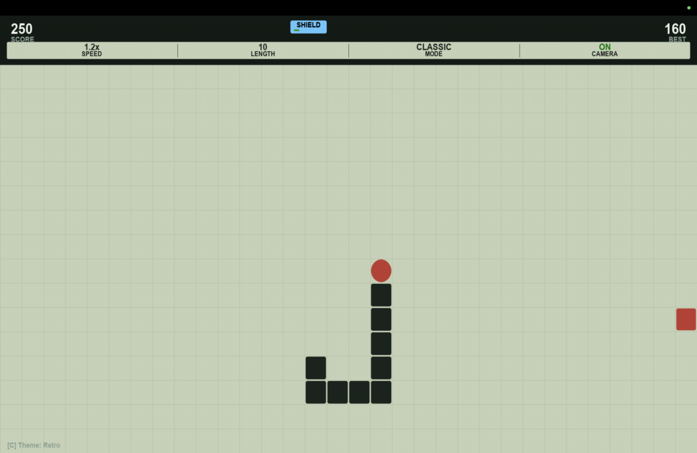
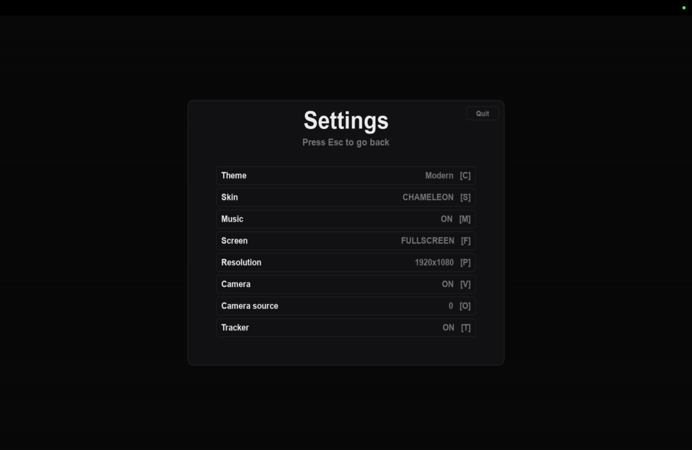
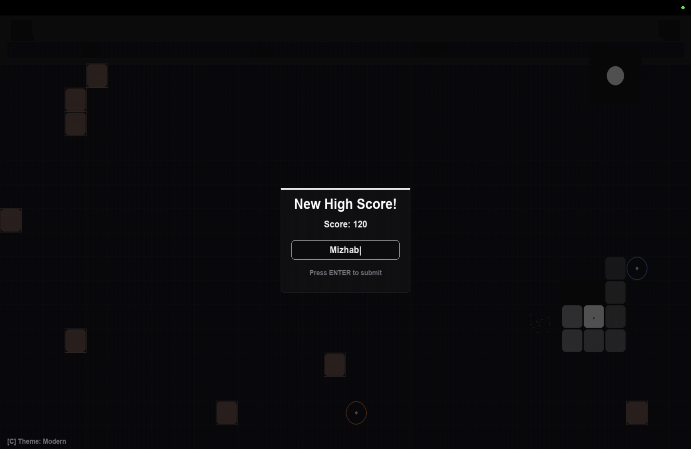
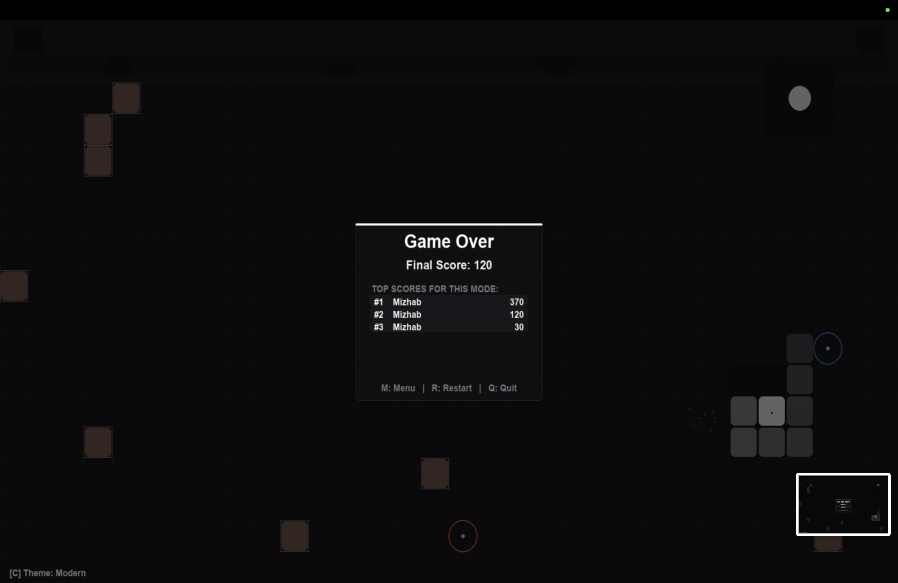

# Snake Game - Hand Gesture Control

[](https://github.com/mizhab-as/Snake-Game/releases)
[](https://github.com/mizhab-as/Snake-Game/actions)
[](https://www.python.org/)
[](LICENSE)

A modern, desktop Snake game written in Python with real-time hand gesture controls powered by MediaPipe and OpenCV. Control the snake seamlessly using hand swipes in front of your webcam, or play using conventional keyboard controls. Built with Pygame-CE, featuring multi-mode gameplay, dynamic power-ups, customizable themes, skin customization, local leaderboards, and synthesized audio.

Available as a standalone executable for **Windows (.exe)** and **macOS (.app)** with zero dependencies required.

---

## Gameplay Previews & Interface

### Mode Selection
Choose between Classic, Arcade, and Zen modes from a clean UI card interface.



### Modern Arcade Gameplay
Arcade mode features interactive portals, obstacles, food streaks, dynamic particle explosions, active power-up tracking, and optional real-time webcam motion tracking.



### Retro Game Boy Theme
Switch anytime to a nostalgic 2-bit green LCD grid theme with high-contrast pixel block snake segments and classic sound feedback.



### Comprehensive Settings Menu
Tune resolution, toggle full-screen, switch camera hardware sources, toggle live camera PIP view, and manage motion tracking overlays.



### High Scores & Local Leaderboard
Record high scores per mode in a local JSON storage system with a clean player-name entry dialog.




### Video Demonstration
Gameplay demonstration video is available at [`assets/videos/11.mp4`](assets/videos/11.mp4).

---

## Features

### ✋ Computer Vision & Gesture Control
- **MediaPipe Hand Tracking**: Real-time hand landmark detection tracking the palm reference point (Middle Finger MCP) for stable swipe registration.
- **Directional Swipe Recognition**: Swipe **UP**, **DOWN**, **LEFT**, or **RIGHT** in mid-air to direct the snake.
- **Noise Filtering & Frame Caching**: 10-frame rolling window smoothing (`deque`) prevents accidental turns, while per-frame inference caching ensures high FPS.
- **Webcam PIP & Motion Tracker**: Live video feed PIP inset in the corner with hand tracking overlay points.

### 🎮 Game Modes
- **Classic**: The timeless Snake experience with wrapping screen boundaries and continuous speed scaling.
- **Arcade**: Dynamic gameplay with randomly generated obstacles, inter-dimensional warp portals (teleporting the snake from Portal A to Portal B), and timed power-up drops.
- **Zen**: Infinite, mortality-free mode designed for casual play, testing hand gestures, or relaxed gaming.

### ⚡ Power-Ups & Mechanics
- 🛡️ **Shield**: Prevents fatal collisions with obstacles, walls, or self-intersections.
- ⚡ **Speed Boost**: Temporarily boosts snake movement speed.
- ❄️ **Freeze**: Slows game tick rate for precision maneuvering.
- ✖️ **Score Multiplier (2x)**: Doubles points earned for all food collected while active.
- 👻 **Ghost Mode**: Allows the snake to pass through its own body segments without dying.

### 🎨 Themes & Customization
- **Modern Theme**: Matte dark interface with radial glow effects, rounded UI cards, clean typography, and particle explosions.
- **Retro Theme**: Classic Game Boy LCD aesthetic featuring sage green grids and dark pixel blocks.
- **Snake Skins**:
  - **Chameleon**: Smooth color transitions across the snake body.
  - **Neon Glow**: High-contrast outline with glowing head.
  - **Rainbow**: Gradient spectrum body segments.

### 🎵 Audio Engine
- Custom-synthesized sound effects generated natively using NumPy sound buffers in Pygame-CE (no external audio files required).
- Distinct sound feedback for eating food, picking up power-ups, warping through portals, and game-over events.

---

## Quick Controls & Shortcuts

| Action | Hand Gesture | Keyboard Key |
|---|---|---|
| **Move Up** | Swipe Up | `↑` or `W` |
| **Move Down** | Swipe Down | `↓` or `S` |
| **Move Left** | Swipe Left | `←` or `A` |
| **Move Right** | Swipe Right | `→` or `D` |
| **Navigate Menus** | — | `↑` / `↓` |
| **Select Menu Item** | — | `Enter` |
| **Open Settings** | — | `H` |
| **Cycle Theme** | — | `C` |
| **Cycle Snake Skin** | — | `S` |
| **Toggle Audio** | — | `M` |
| **Toggle Camera** | — | `V` |
| **Cycle Camera Source** | — | `O` |
| **Toggle Motion Tracker** | — | `T` |
| **Toggle Camera PIP** | — | `B` |
| **Toggle Fullscreen** | — | `F` |
| **Cycle Resolution** | — | `P` |
| **Gesture Help Dialog** | — | `?` |
| **Pause / Menu / Quit** | — | `Esc` / `M` / `Q` |

---

## Download & Installation

### Option 1: Standalone Releases (Recommended)
Download pre-packaged, zero-dependency executables directly from the **[GitHub Releases](https://github.com/mizhab-as/Snake-Game/releases)** page:
- **macOS**: Download `SnakeGame_macOS.zip`, extract, and open `SnakeGame.app`.
- **Windows**: Download `SnakeGame.exe` and run directly.

### Option 2: Run From Source

#### Prerequisites
- Python 3.10 or Python 3.11
- A working webcam (required for hand tracking; keyboard mode works without a camera)

#### Automated Setup (Convenience Scripts)
Clone the repository and run the setup script for your OS (it automatically configures a virtual environment and installs dependencies):

**macOS / Linux:**
```bash
git clone https://github.com/mizhab-as/Snake-Game.git
cd Snake-Game
chmod +x run.sh
./run.sh
```

**Windows:**
```cmd
git clone https://github.com/mizhab-as/Snake-Game.git
cd Snake-Game
run.bat
```

#### Manual Setup
```bash
git clone https://github.com/mizhab-as/Snake-Game.git
cd Snake-Game

# Create and activate virtual environment
python3 -m venv venv
source venv/bin/activate  # On Windows: venv\Scripts\activate

# Install required packages
pip install -r requirements.txt

# Launch game
python src/main.py
```

---

## Technical Architecture & How Hand Tracking Works

```
Snake-Game/
├── src/
│   ├── main.py           # Pygame window management, UI rendering, menu loops, settings, and main engine loop
│   ├── snake.py          # Core game logic, grid state, snake physics, power-up mechanics, portal teleportation
│   └── hand_tracking.py  # MediaPipe Hand solution, OpenCV capture pipeline, deque gesture recognition
├── assets/
│   ├── screenshots/      # Gameplay screenshots for documentation
│   └── videos/           # Gameplay demonstration recordings
├── SnakeGame.spec        # PyInstaller specification file for macOS (.app bundle with entitlement configs)
├── SnakeGame-Windows.spec# PyInstaller specification file for Windows (.exe standalone)
├── .github/workflows/    # CI/CD workflow for automated multi-platform PyInstaller builds and GitHub Releases
├── requirements.txt      # Dependency manifest (pygame-ce, opencv-contrib-python, mediapipe, numpy)
├── run.sh / run.bat      # Native runner scripts with automated venv creation
└── README.md
```

### Hand Tracking Implementation
1. **Camera Frame Acquisition**: OpenCV captures raw video frames at 640x480 resolution (using `CAP_AVFOUNDATION` on macOS for hardware acceleration).
2. **Inference Caching**: To prevent running heavy ML models multiple times in a single frame update, `_process_frame_cached()` stores the MediaPipe output by frame memory ID.
3. **Reference Landmark**: Uses Landmark 9 (Middle Finger MCP) as the palm center anchor point rather than fingertips for stable tracking.
4. **Displacement Calculation**: Maintains a rolling history of 10 coordinates. A swipe is registered when relative spatial movement exceeds the threshold (0.025 normalized coordinate delta) along the dominant axis.
5. **Auto-Reset**: Swipes automatically flush the position history to avoid double-triggering or continuous key-like repeats.

---

## Building Standalone Executables

The repository includes PyInstaller configuration files that package MediaPipe's binary graphs, model files (`.tflite`), and label maps (`handedness.txt`) into the bundle:

```bash
# Build macOS .app
pyinstaller -y SnakeGame.spec

# Build Windows .exe
pyinstaller -y SnakeGame-Windows.spec
```

Bundled binaries are generated inside the `dist/` directory.

---

## Dependencies

- **`pygame-ce`** (>= 2.5.7): Community Edition of Pygame for rendering, event dispatch, and audio synthesis.
- **`opencv-contrib-python`** (>= 4.10.0): Real-time video frame acquisition and color conversion.
- **`mediapipe`** (== 0.10.5): Machine learning hand landmark extraction.
- **`numpy`** (>= 1.26.0): Matrix math for audio waveform synthesis and frame processing.

---

## License

Distributed under the MIT License. See [LICENSE](LICENSE) for details.

## Author

Created by **[Mizhab A S](https://github.com/mizhab-as)**.
