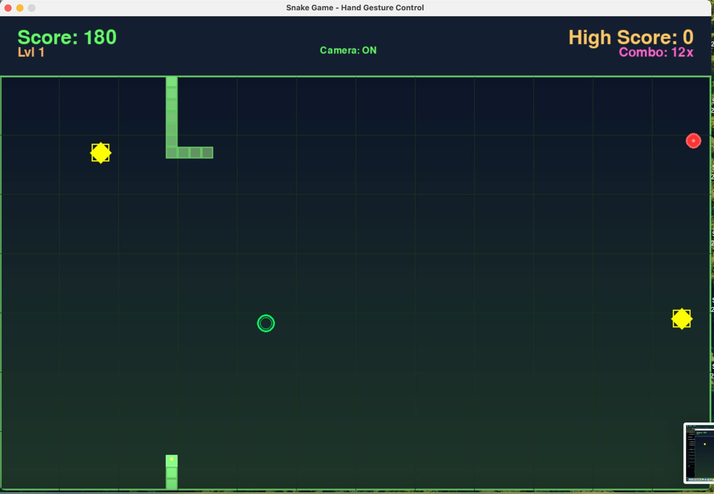
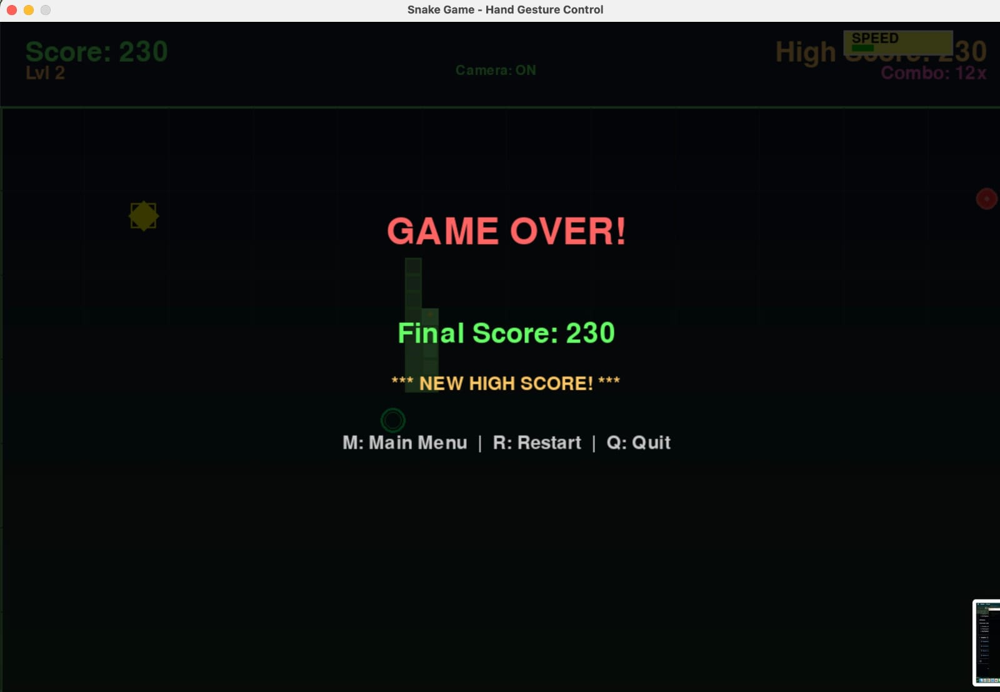
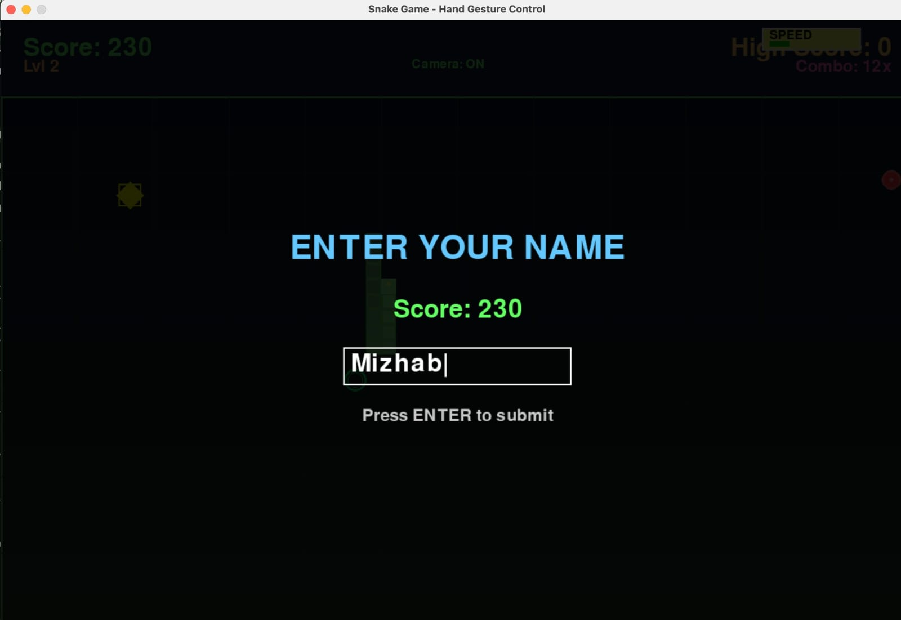
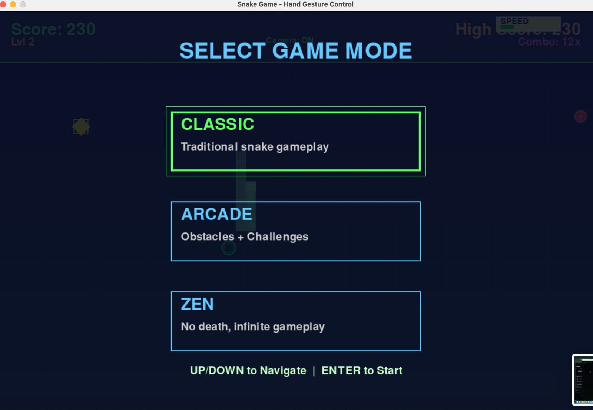

# Snake Game with Hand Gesture Control

A Snake game with hand gesture control using computer vision. Features multiple game modes, leaderboard system, power-ups, and a gorgeous dual-theme design system.

## Features

### Dual Themes (Toggled with **C**)
- **Modern**: Charcoal matte dark layout, rounded corners, soft glowing outline borders, and size-pulsing food.
- **Retro**: Nokia LCD style featuring a sage green board, high-contrast near-black snake body segments, circle snake head, and size-pulsing blocky retro food.

### Game Modes
- **Classic**: Traditional snake with wrapping borders
- **Arcade**: Obstacles, portals, and dynamic challenges that increase with difficulty
- **Zen**: No death, relaxed speed, and infinite gameplay

### Controls
- **Hand Gestures**: Move your hand up/down/left/right to control snake (requires camera)
- **Keyboard**: Arrow keys or WASD keys
- Press **C** to cycle theme, **H** for gesture help, **L** for leaderboard, **R** to restart, **M** for main menu, **Q** or **ESC** to quit/exit the game instantly.

### Gameplay & UI Polish
- **Segmented Stats Panel**: Taller, high-contrast, segmented stats panel displaying Speed, Length, Mode, and Camera state with zero text overlap.
- **Card-Style Dialog Popups**: Centered dialog boxes for Pause, High Score name entry, and Game Over.
- **Centered Name Entry**: Player name and cursor are perfectly centered inside the leaderboard name input field.
- Power-ups: Speed Boost, Score Multiplier (2x), Shield
- Progressive difficulty increases every 200 points
- Combo system tracks consecutive food eaten
- Particle effects for visual feedback
- Top 10 leaderboard with player names

## Screenshots And Videos

### Screenshots






### Demo Videos

- [Watch Demo Video 1](assets/videos/5.mp4)
- [Watch Demo Video 2](assets/videos/6.mp4)

## Installation

Requires Python 3.10+ and a webcam (optional for hand tracking).

### Option 1: Run From Source
```bash
git clone https://github.com/mizhab-as/Snake-Game.git
cd Snake-Game
python -m venv venv
venv\Scripts\activate      # On Windows
source venv/bin/activate   # On macOS/Linux
pip install -r requirements.txt
python src/main.py
```

### Option 2: Standalone Windows Executable
- Run `dist/SnakeGame.exe` directly
- No Python installation required

## How to Play

1. Start the game with `python src/main.py` or launch the app
2. Select mode with UP/DOWN arrows, press ENTER
3. Control snake with hand gestures or keyboard
4. Collect food and power-ups, avoid obstacles
5. Try to beat the high score

## Project Structure

```
snake_game/
├── src/
│   ├── main.py           # Game loop and UI
│   ├── snake.py          # Game logic
│   └── hand_tracking.py  # Hand gesture detection
├── requirements.txt
└── README.md
```

## Tech Stack

- pygame (game engine)
- OpenCV (video capture)
- MediaPipe (hand tracking)
- NumPy (math)

## Scoring

- Food: 10 points × difficulty × multiplier
- Power-up: 50 points
- Combo system for consecutive food

## Building Executable (Windows)

To bundle the game into a standalone `.exe` executable:

1. Activate your virtual environment and install PyInstaller:
   ```bash
   venv\Scripts\activate
   pip install pyinstaller
   ```
2. Build the executable using the spec file:
   ```bash
   pyinstaller --clean SnakeGame-Windows.spec
   ```
The standalone executable will be generated at `dist/SnakeGame.exe`.

## Uploading to GitHub

To share your game on your GitHub page:
1. Commit and push your code updates:
   ```bash
   git add .
   git commit -m "Add dual themes, HUD improvements, and bug fixes"
   git push origin main
   ```
2. Go to your repository on GitHub.
3. Click on **Releases** -> **Create a new release**.
4. Drag and drop the built `dist/SnakeGame.exe` file into the release binaries box.
5. Publish the release so players can download and run it directly!

## Contributing

Feel free to report bugs, suggest features, or submit pull requests.

## License

MIT License

## Author

Mizhab A S
